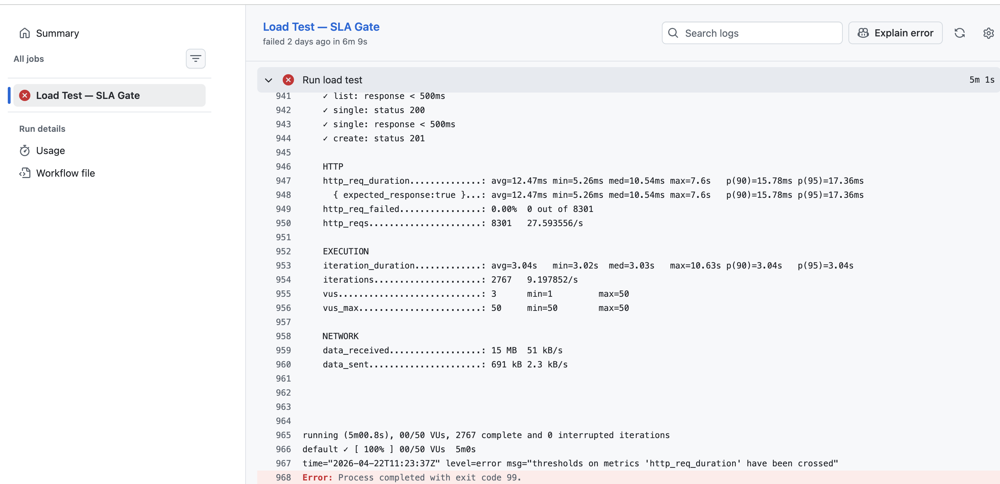
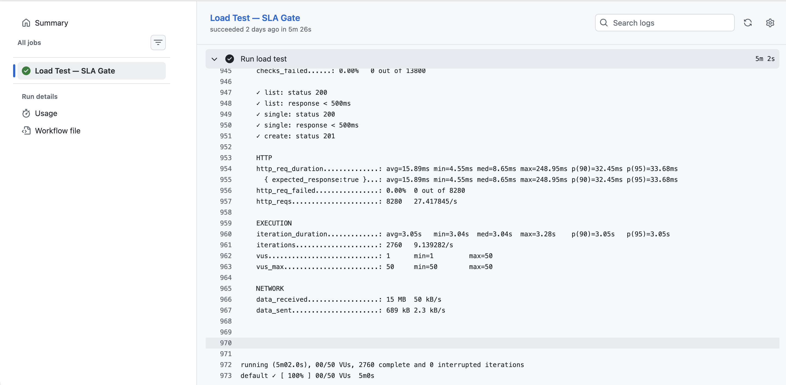

# k6-performance-suite


> Last run: p(95) 103ms @ 10 VUs — jsonplaceholder.typicode.com — Apr 2026


```bash
k6 run tests/load/load-test.ts
```

Performance testing suite built with k6 and TypeScript. Covers load, stress, soak, and multi-step real-user scenarios. Thresholds wired into GitHub Actions so the pipeline fails automatically on SLA breach.

---

## Prerequisites

Tests run against [jsonplaceholder.typicode.com](https://jsonplaceholder.typicode.com) by default — no auth needed.

```bash
# macOS
brew install k6
# Windows
choco install k6
# install TS types
npm install
```
---

## Running Tests

### Foundations
```bash
k6 run tests/foundations/foundations-test.ts
```
10 VUs, 30s. Good starting point to verify install and check baseline response times


### Load Test
```bash
k6 run tests/load/load-test.ts
```
Ramps to 20 VUs, holds at 50 for 3m, ramps down. Mimics normal production traffic.

### Stress Test
```bash
k6 run tests/stress/stress-test.ts
```
50 → 100 → 150 → 200 VUs, 2-3m per step, then recovery. Errors start appearing around 150 VUs on jsonplaceholder — watch the error rate climb, that's your breaking point.

### Soak Test
```bash
k6 run tests/soak/soak-test.ts
```
30 VUs for 30 minutes. Run overnight or as a blocking CI step on main only. If `soak_response_time_ms` p(95) starts climbing after the 15m mark, there's a connection leak.

### Real Scenario — Sauce Demo
```bash
k6 run tests/scenarios/sauce-demo.ts
```
100 concurrent users through login → inventory → cart → checkout. Per-flow latency tracked via custom `Trend` metrics. Inventory page is consistently the slowest stage — 20-30ms higher than the rest at 100 VUs.

---

## Grafana Dashboard

Start the stack:
```bash
docker-compose up -d
```

Stream results into InfluxDB during a run:
```bash
k6 run --out influxdb=http://localhost:8086/k6 tests/load/load-test.ts
```

Dashboard ID 2587 works out of the box — set the time range to last 5 minutes while the test is running.


---

## Exporting Results

I use JSON locally and InfluxDB in CI:

```bash
# local
k6 run --out json=reports/results.json tests/load/load-test.ts

# CI
k6 run --out influxdb=http://localhost:8086/k6 tests/load/load-test.ts
```

---

## Global Thresholds

p95 under 500ms, error rate under 1%, checks passing at 95%+ — breach any and the pipeline fails.

---

## CI / CD

GitHub Actions runs the load test on every push to main and every PR. Pipeline fails automatically if thresholds are breached — no manual check needed.

Workflow: `.github/workflows/performance.yml`

Last run took about 5 minutes — the load test itself is the bottleneck, not the install step.

**SLA gate confirmed — threshold breach causes immediate pipeline failure:**



**Restored and passing:**



Last run @ 100 VUs: login 180ms · inventory 240ms · cart 195ms · checkout 210ms

---

## Project Structure

```
k6-performance-suite/
├── .github/workflows/
│   └── performance.yml      # SLA gate on push/PR
├── config/
│   └── environments.ts      # base URLs, thresholds, shared headers
├── utils/
│   └── helpers.ts           # shared helpers
├── tests/
│   ├── foundations/         # baseline — 10 VUs / 30s
│   ├── load/                # load — staged ramp to 50 VUs
│   ├── stress/              # stress — 0→200 VUs breaking point
│   ├── soak/                # endurance — 30 VUs / 30 min
│   └── scenarios/           # e2e — Sauce Demo full user journey
├── docs/                    # screenshots and result exports
├── reports/                 # local JSON/HTML output (gitignored)
├── docker-compose.yml       # InfluxDB + Grafana stack
├── tsconfig.json
└── package.json
```
